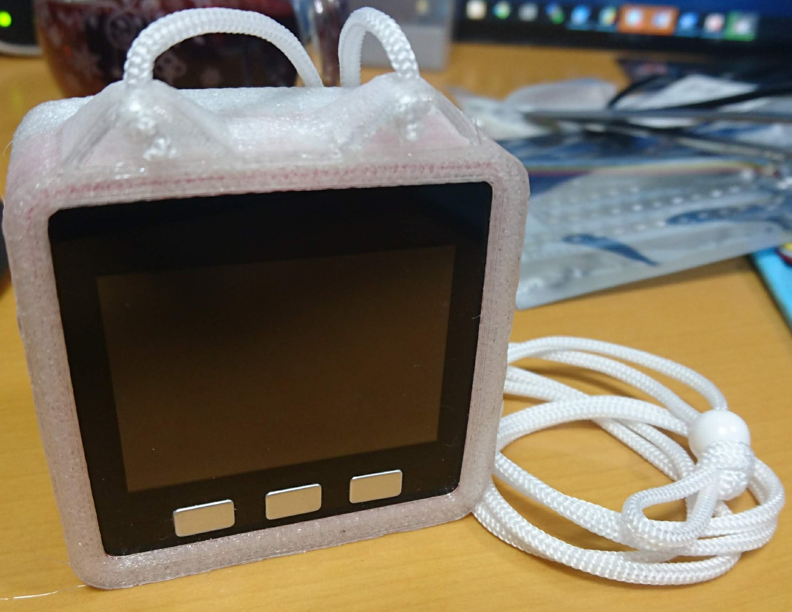
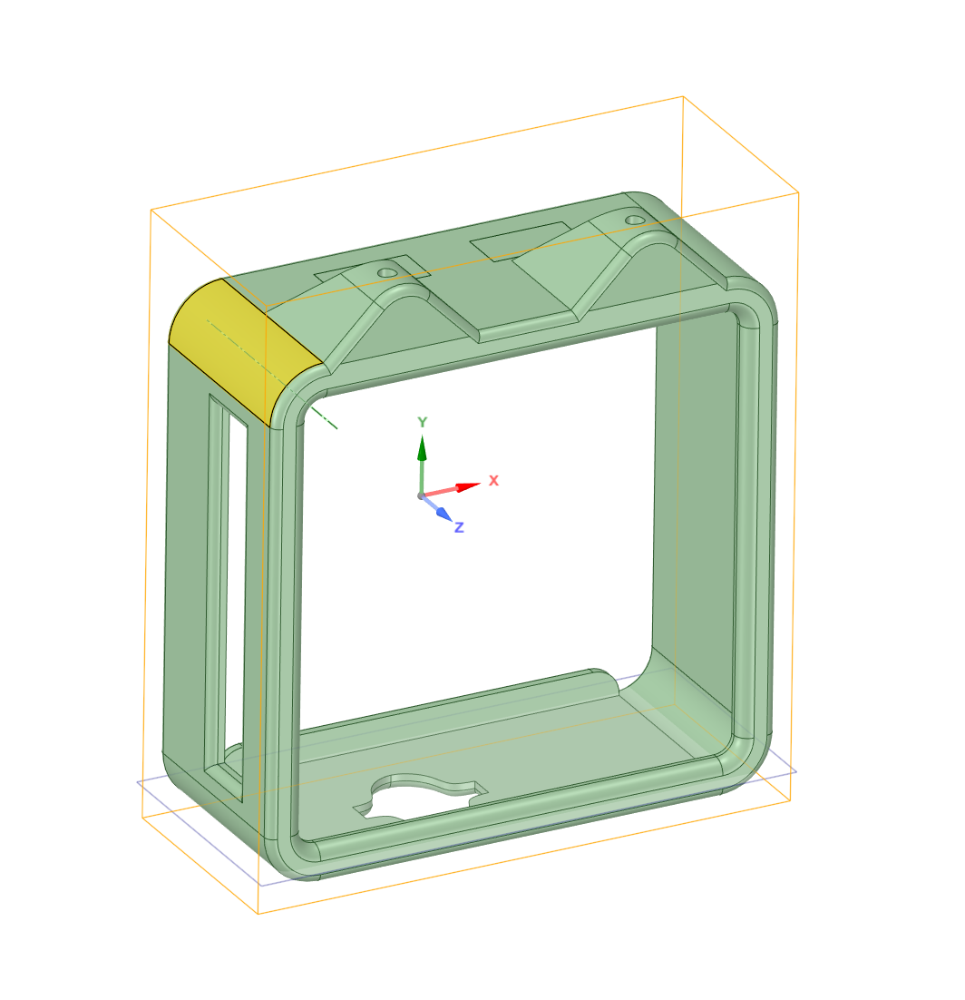

# M5Stack用TPUカバー

## 概要

M5Stack用のTPUカバー。各ポートにアクセスするための穴や首掛け用のストラップを付けられるストラップホールが付いている。

## 内容

* Design Spark Mechanical 4.0用の設計データ
* 3Dプリンタ出力用STL

| 対象M5Stack | 形式 |
|:-----|:------|
| M5Stack BASIC/GRAY | [Design Spark Mechanical](M5Stack_Basic_OuterCover.rsdoc) |
| M5Stack BASIC/GRAY | [STL](M5Stack_Basic_OuterCover.stl) |
| M5Stack BASIC/GRAY | [Cura Project](PSME_M5Stack_Basic_OuterCover.3mf) |
| M5Stack Go/Fire | [Design Spark Mechanical](M5Stack_Fire_OuterCover.rsdoc) |
| M5Stack Go/Fire | [STL](M5Stack_Fire_OuterCover.stl) |
| M5Stack Go/Fire | [Cura Project](PSME_M5Stack_Fire_OuterCover.3mf) |

## 確認環境

* PrintrBot Simple Metal with Heat Bed
* Cura 4.0
* Pxmalion TPU 1.75 Clear

## ライセンス
 M5Stack Fire OuterCover by <a xmlns:cc="http://creativecommons.org/ns#" href="https://github.com/ciniml/M5Stack_Gadgets/OuterCover/" property="cc:attributionName" rel="cc:attributionURL">Kenta IDA</a> is licensed under a <a rel="license" href="http://creativecommons.org/licenses/by/4.0/">Creative Commons Attribution 4.0 International License</a>.
