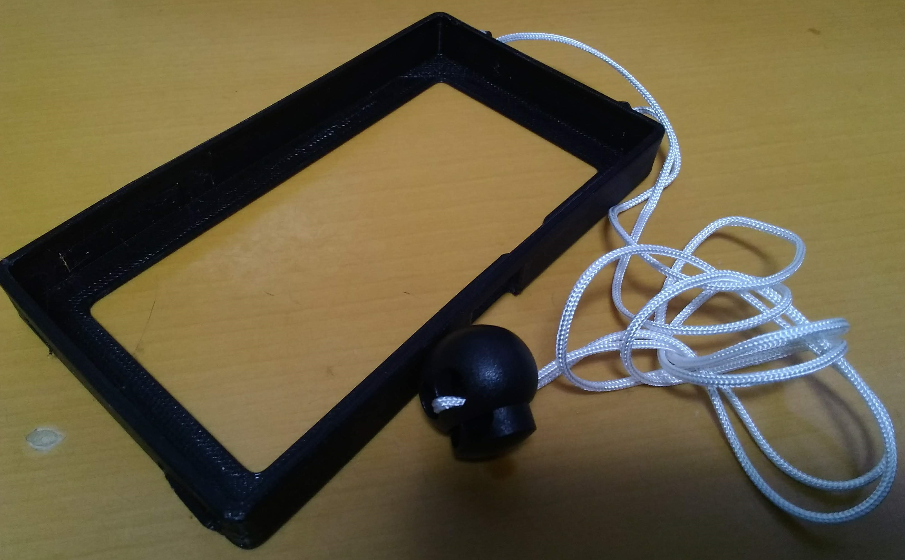
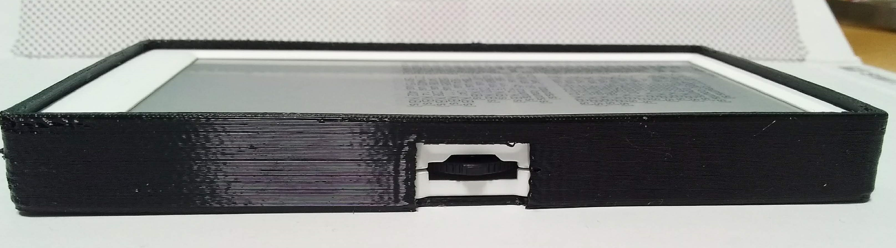
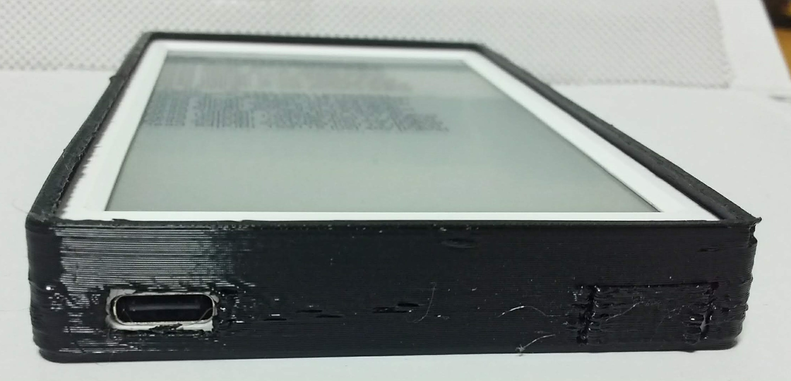

# M5Paper用 ソフトカバー

## 概要

M5Paper用のソフトカバー。 上側にストラップを取り付つけるためのストラップホールがあり、首から提げるて使える。

## 内容

* Design Spark Mechanical 4.0用の設計データ
* 3Dプリンタ出力用STL

|  形式 |
|:------|
| [Design Spark Mechanical](M5Paper.rsdoc) |
| [STL](M5Paper_OuterCover_Reduced.stl) |
| [Cura Project](PS_M5Paper_OuterCover_Reduced.3mf) |

## 確認環境

* PrintrBot Simple Metal with Heat Bed
* Cura 4.7
* ColorFabb nGen FLEX (Black)

## ライセンス
 M5Stack Fire OuterCover by <a xmlns:cc="http://creativecommons.org/ns#" href="https://github.com/ciniml/M5Stack_Gadgets/OuterCover/" property="cc:attributionName" rel="cc:attributionURL">Kenta IDA</a> is licensed under a <a rel="license" href="http://creativecommons.org/licenses/by/4.0/">Creative Commons Attribution 4.0 International License</a>.
